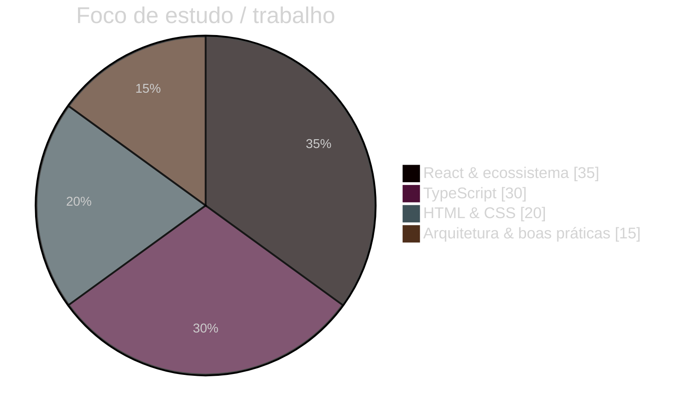
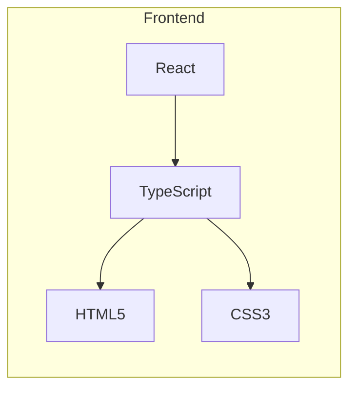

# Olá, eu sou o Geymerson

**Frontend Developer** · React · TypeScript · interfaces que fazem sentido

---

## Métricas no GitHub

| Estatísticas gerais | Linguagens mais usadas |
|:---:|:---:|
|  |  |

Sequência de commits · **contributions**

Atividade nos últimos dias

Troféus do perfil

---

## Stack em destaque

Distribuição ilustrativa do foco atual (complementa as estatísticas dos repositórios acima).

---

## Tecnologias

  

---

## Agora

- Trabalhando como **Frontend Developer**
- Stack principal: **React** + **TypeScript**
- Aprofundando **TypeScript avançado** e **arquitetura frontend**

---

## Redes e contato

Substitua os links genéricos acima pelos seus perfis reais e atualize o e-mail.

